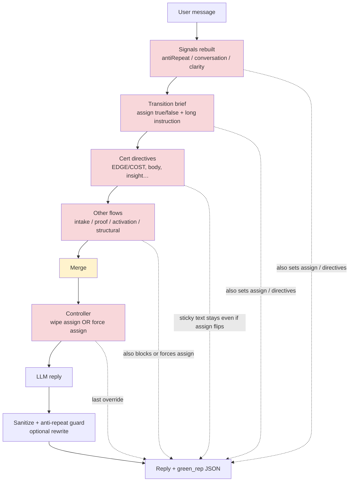
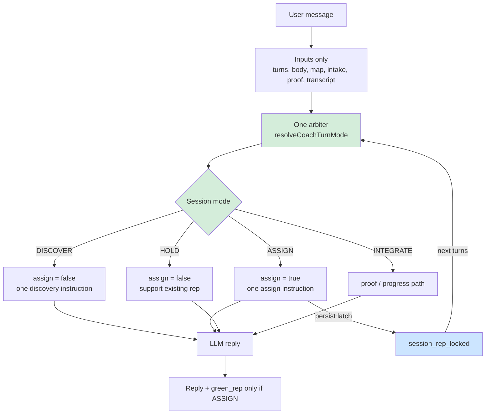

# Coach architecture: now vs after (turn-mode arbiter)

Open this file in Cursor / VS Code / GitHub preview to see the Mermaid diagrams.

**Status:** implemented in `backend/src/stage1/coach/flows/turnMode.js`, applied from `stage1CoachController` after signal merge. Session latch persisted as `openSession.session_rep_locked` when a Green Rep is saved.

---

## 1. Before (many writers)

Many boxes independently set `assign_green_rep` and append instructions, so the prompt can contradict itself.

**Problem in one line:** many writers fight over one decision; leftover instructions stay after assign flips.

---

## 2. After (one arbiter) — current design

One place decides the mode; everyone else only feeds inputs; assign and instruction always match.

**Fix in one line:** one arbiter sets mode + assign + one instruction; session latch stops re-assign / duplicate speech.

---

## Quick reference

| Mode | Assign? | Job |
|------|---------|-----|
| DISCOVER | no | Ask / reflect only |
| ASSIGN | yes | Name pattern + one Green Rep (mechanism ready + wants next step / turn cap) |
| HOLD | no | Support existing rep for this session |
| INTEGRATE | no | Proof / progress path |

## Key files

- `backend/src/stage1/coach/flows/turnMode.js` — arbiter
- `backend/src/controllers/stage1CoachController.js` — applies arbiter after merge
- `backend/src/stage1/coach/persistence/history.js` — sets `session_rep_locked` when Green Rep saved
