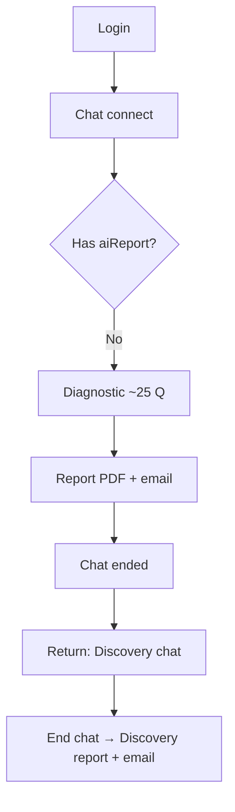

# Euphoriam AI — Complete Implementation Guide (Stage 1, V2 MVP, Stage 2)

**Audience:** Yashal / Euphoriam AI build team (frontend + backend)  
**Sources:**
- Client Document 1 — *Euphoriam AI - Stage 1 Implementation Instructions*
- Client Document 2 — *Euphoria version 2 MVP* + Stage 2 build milestones (*“Have a read before we chat — Don’t start”*)
- Nathan King email (May 2026) — Brain Prompt V2 evolution + shadow/test prompts  
**Backend repo:** `euphoriam-backend`

---

## Table of contents

1. [Purpose & core principle](#purpose--core-principle)
2. [Goals vs domains (FAQ)](#goals-vs-domains-faq)
3. [What does not change](#what-does-not-change)
4. [Current paid flow vs target flows](#current-paid-flow-vs-target-flows)
5. [Document 1 — Stage 1 (full spec)](#document-1--stage-1-full-spec)
6. [Document 2 — V2 MVP four tabs](#document-2--v2-mvp-four-tabs)
7. [Document 2 — Stage 2 milestones (1–14)](#document-2--stage-2-milestones-114)
8. [Brain Prompt V2 — complete change list (Nathan)](#brain-prompt-v2--complete-change-list-nathan)
9. [Schemas & JSON writeback](#schemas--json-writeback)
10. [Membership logic](#membership-logic)
11. [Navigation, screens & CTAs](#navigation-screens--ctas)
12. [Daily coach, friction, progress](#daily-coach-friction-progress)
13. [Suggested training & content tagging](#suggested-training--content-tagging)
14. [Build milestones & phased backend plan](#build-milestones--phased-backend-plan)
15. [Backend implementation (this repo)](#backend-implementation-this-repo)
16. [Migration, edge cases & testing](#migration-edge-cases--testing)
17. [Document map & reconciliation](#document-map--reconciliation)

---

## Purpose & core principle

### The shift

| Before | After (paid) |
|--------|----------------|
| Diagnosis-first chat | **Outcome-first** implementation |
| One general life map | **Per-domain** structure around a **specific goal** |
| Generic follow-up chat | **Daily Structural Performance Coach** + **proof** |

**Stage 1 outcome:** We already have the diagnostic engine and chat about stored structure. Stage 1 adds the missing journey: define what they are creating → map structure around that goal → coach daily to stop failure strategy and install success strategy.

**Stage 2 / V2:** Brain and app become **goal-specific** — *“What structure activates when this person tries to achieve **this specific goal**?”*

### Core principle

> **Your structure creates your results.**

Euphoriam AI helps the user **see it**, **stop it**, and **install the new structure** that creates the outcome they want.

### Audience & scope

- **Paid users inside Euphoriam AI** — Stage 1 + V2 MVP + Stage 2  
- **Free diagnosis lead generator (funnel / IRL)** — **does not change**

---

## Goals vs domains (FAQ)

### Domain — **select** (fixed list)

| Rule | Detail |
|------|--------|
| User action | **Select** one of five (picker / cards / dropdown) |
| Values | `income`, `alignment`, `relationships`, `health`, `wealth` |
| Labels | Income, Alignment, Relationships, Health, Wealth |
| Not allowed | Free-text domain (“Career”, “Parenting”) unless product adds a 6th later |
| Membership | Controls **how many** domains are active/stored — not the list itself |

```text
domain ∈ ['income','alignment','relationships','health','wealth']  // API must validate
```

### Goal — **enter** (user-defined, guided)

| Field | Input type |
|-------|------------|
| `goal_title`, `desired_outcome`, `measurable_outcome` | User text |
| `target_date`, `proof_of_success` | User text |
| Milestones (90d / 30d / 7d / today) | User text; AI may **suggest**, user **confirms** |
| Stage 2 extras | Why it matters, current reality, role, behaviours, avoidance, risk, past pattern — all open answers |

| Rule | Detail |
|------|--------|
| Not a catalog | No dropdown “pick predefined goal #3” |
| AI role | Clarify, sharpen measurability — do not replace with templates |

```text
Domain  = WHERE in life     → 5 fixed choices (SELECT)
Goal    = WHAT they create  → free text (guided onboarding)
```

### Goals per tier

| Tier | Stored goals | Active coached domains |
|------|--------------|------------------------|
| Bronze | Up to 3 | 1 |
| Silver | Multiple | 2 |
| Accelerate | Full | All 5 |

**V2 MVP UI:** Often **1 active domain + 1 active goal** at a time.

---

## What does not change

- Free funnel / **Invisible Red Line** lead path (`funnelMode`, `invisible_red_line_report` prompt)
- Canonical **Brain Prompt** library (48 signatures, formula, rep library, UC routing) — **extend**, don’t delete
- Kajabi membership sync pattern (`user.membership` JSONB)

---

## Current paid flow vs target flows

### Today (`euphoriam-backend`)



| Step | User | System |
|------|------|--------|
| 1 | Login | JWT; Kajabi → `membership` (Creator Club / Bronze / Silver) |
| 2 | First chat | `mode: diagnostic`; Brain + Diagnostic prompts |
| 3 | Complete intake | `Diagnostic.data.aiReport`, PDF, email |
| 4 | Return | Socket locks `mode: discovery` if report exists |
| 5 | End discovery | `Discovery` row + follow-up report |

**Gaps:** No Create Goals, no `domain_maps`, goals parsed from report text in `getUserProfile`, no Coach/Friction/Progress tabs.

### Target — Stage 1 (7-step journey)

```text
Create Goals → Choose Domain → Define Outcome → Milestones
  → Map Resistance → Domain Dashboard → Daily Coach
```

### Target — V2 MVP (4 tabs, 1 active domain)

```text
Home | Domains | Coach | Suggested Training
Core loop: Goal → Resistance → Diagnosis → Green Rep → Proof → Progress
```

### Target — paid socket routing (planned)

```text
No domain_maps?     → stage1_onboarding (not discovery-first)
Has active domain?  → coach / home APIs
Legacy aiReport only? → banner Create Goals + optional legacy discovery (product decision)
```

---

## Document 1 — Stage 1 (full spec)

### New customer flow (7 steps)

| Step | Screen / action | What happens |
|------|-----------------|--------------|
| 1 | Home — **Create Goals** | Primary CTA; starts onboarding |
| 2 | **Choose domain** | Income, Alignment, Relationships, Health, Wealth (membership limits) |
| 3 | **Define outcome** | What to create, by when, proof it’s real |
| 4 | **Dates + milestones** | 90-day, 30-day, 7-day, today’s visible action |
| 5 | **Map resistance** | Diagnostic adjusted to **this** outcome (not generic life-only) |
| 6 | **Domain dashboard** | Outcome, milestones, vortex, failure/success, daily rep, progress |
| 7 | **Daily Structural Performance Coach** | Daily + 24/7; detect vortex abduction; next success action |

### Screen A — Home page

**Add button:** Create Goals.

**Dashboard when active domain exists:**
- Active domain(s)
- Primary outcome
- 90-day outcome
- Next milestone
- Today’s visible action
- Failure strategy likely today
- Success strategy to install

**Quick buttons:**
- Start Today’s Rep
- I'm In Friction
- Log Proof

### Screen B — Create Goals onboarding

Ask (then save → Map Resistance):

1. What domain are you working on?
2. What outcome do you want to create?
3. By when?
4. What would prove this is real?
5. What is the 90-day outcome?
6. What is the 30-day milestone?
7. What is the 7-day movement?
8. What is today’s next visible action?

### Screen C — Map resistance / diagnostic adjustment

- Use **existing** diagnostic process
- Prompts scoped to **domain + outcome + milestones**
- Must produce **vortex for this outcome**, not general life map only

| Output | User-facing meaning |
|--------|---------------------|
| Vortex signature | EO + Lack + Avoid |
| Failure strategy | Predictable sabotage toward the goal |
| Top 3 avoidance behaviours | Specific sabotage to watch |
| Success strategy | Opposite from Brain Prompt opposite map |
| Daily rep | One behaviour installing success structure today |

### Example — Income domain (client spec)

| Item | Example |
|------|---------|
| Domain | Income |
| Outcome | Launch diagnostic funnel + masterclass |
| 90-day | Consistent lead flow + 25 UC sales |
| 30-day | Funnel live + launch date confirmed |
| 7-day | Finalise rollout |
| Today | Send launch date to Lee |
| Vortex | Needs Not OK + Security + Rejection |
| Failure strategy | Hide income desire; refine vs release; avoid visible asks |
| Top 3 avoidance | Downplay goal/value; refine vs launch; avoid follow-up |
| Success strategy | Wanting more allowed; visibility; clear invitation |
| Daily rep | Send launch date before improving anything else |
| Win condition | Date sent. Not perfect. Sent. |

### Stage 1 — seven navigation tabs

| Tab | Purpose | Required contents |
|-----|---------|-------------------|
| **Home** | Daily overview | Active domain, outcome, milestone, today’s rep, failure/success today, quick buttons |
| **Domains** | List domains | Five domains; status: Active, Available, Locked, Stored Goal |
| **Domain detail** | Deep view | Outcome, dates, plan, vortex, failure, top 3 avoidance, success, daily rep, progress |
| **Coach** | Daily coach | Check-in, friction detection, failure interruption, success rep, proof, one resource if needed |
| **Friction** | Fast rescue | What’s happening; domain; active failure strategy; success move |
| **Progress / Proof** | Evidence | Rep completion, recovery, avoidance caught, milestones, proof notes |
| **Map** | Structure map | EO, Lack, Avoid, orbit, protector, gravity, CL, failure/success, opposites |

### Stage 1 build milestones (client §10)

| # | Task | Done when |
|---|------|-----------|
| 1 | Create Goals on Home | Paid users start flow |
| 2 | Membership-aware domain selector | Bronze / Silver / Accelerate limits |
| 3 | Outcome + milestones intake | Save all date fields + today’s action |
| 4 | Goal-scoped diagnostic | Output tied to domain/outcome |
| 5 | Domain detail page | Full cards visible |
| 6 | Daily Coach flow | Check-in, detect, rep, proof |
| 7 | Progress / Proof dashboard | Metrics visible |
| 8 | Writeback Supabase / state vector | Per-domain persistence |

---

## Document 2 — V2 MVP four tabs

> **Note:** *“Have a read of this before we chat — Don’t start”* — align with Nathan before coding.

**MVP scope:** Four tabs only — **not** a complex life dashboard.

| Tab | Purpose |
|-----|---------|
| **Home** | Simple daily overview — structural + physical performance |
| **Domains** | Active goal; **only 1 domain active in MVP** |
| **Coach** | Daily transformation — state, gravity, targeted chat, Green Rep, proof |
| **Suggested Training** | **One** UC / Silver / Creator Club pick for today’s resistance |

### Home (MVP detail)

**Structural performance:** gravity, active pattern, failure strategy, success strategy, red patterns caught, recovery speed.

**Physical performance:** active goal, current milestone, visible actions, weekly progress.

User thought: *“Am I changing structure AND producing real-world movement?”*

### Domains (MVP detail)

- User picks domain (Income, Alignment, Relationships, Wealth, Health)
- Simple onboarding: goal, measurable outcome, milestone, failure strategy, success strategy
- Dashboard: what I’m creating, milestone, how I sabotage, what I protect against, cost, new belief/behaviour

### Coach (MVP detail)

**Report state:** Abducted by Vortex | High Gravity | Clear + Able | Progress  
**Rate:** gravity (and recovery where applicable)

Coach uses: domain, goal, failure strategy, protector, rules, fear, success strategy — **not generic advice**.

**Sequence:** name state → avoidance → fear → protector/rule → reduce gravity → **one Green Rep** → log proof.

**Coach questions (human tone):**
- What feels like it is holding you back today?
- What are you avoiding?
- What feels unsafe about taking the next action?
- What are you afraid will happen if you move now?
- What is the old rule trying to protect?
- What would the success strategy do here?
- What is the smallest Green Rep you can complete today?

### Suggested Training (MVP detail)

- Not a content library
- **One** recommendation with: title, source (UC/Silver/Creator Club), why chosen, outcome supported, after-watching action, Open Training button

### V2 core loop

```text
See what they are creating
  → See what structure is stopping it
  → Get coached through resistance
  → Take one new action
  → Log proof
```

### Simplest version of Stage 2 (client summary)

1. User picks one domain  
2. User sets one goal  
3. AI diagnoses what will sabotage that goal  
4. AI creates 30-day plan  
5. Coach helps them act daily  
6. User logs proof  
7. Home shows structural + physical progress  
8. Suggested Training gives the right tool at the right moment  

---

## Document 2 — Stage 2 milestones (1–14)

### Milestone 1 — Upgrade Brain Prompt

Brain becomes central OS. Must know and use:

- Formula: **Signal to the Field = QGC × CL × Gravity**
- 48 vortex signatures (EO × Lack × Avoid)
- CL (notice, interrupt, choose, act, recover — not spiritual score)
- Failure strategy, success strategy, treatment logic, coaching logic, training recommendation logic

Every response grounded in: Domain, Goal, Milestone, Vortex, Failure strategy, CL, Current resistance, Success strategy, Next Green Rep, Proof logged.

### Milestone 2 — Goal-specific onboarding

Inside Domains tab. MVP: **one active domain**.

Extract:

| # | Field |
|---|--------|
| 1 | Domain (5 options) |
| 2 | Specific goal |
| 3 | Measurable outcome |
| 4 | Target date |
| 5 | Why it matters |
| 6 | Current reality |
| 7 | Milestones (3–8) |
| 8 | Required identity/role |
| 9 | Required behaviours |
| 10 | Known avoidance |
| 11 | Perceived risk |
| 12 | Past pattern |

### Milestone 3 — Goal-specific diagnostic

Question: *“What structure activates when this person tries to achieve this specific goal?”*

Identify: vortex signature, top 3 avoidance behaviours, failure strategy, protector, rule, fear, cost, CL impact, opposite settings (belief, behaviour, rule).

### Milestone 4 — Map resistance to milestones

**MVP:** one goal → one primary vortex → one failure/success → one 30-day plan.  
**Later:** different resistance per milestone (visibility vs rejection vs responsibility).

### Milestone 5 — 30-day treatment plan

Week 1 Awareness → Week 2 Interruption → Week 3 Green Rep installation → Week 4 Proof + embodiment.

Includes: weekly focus, daily Green Reps, red pattern awareness, proof logging, training recommendations, recovery practice.

### Milestone 6 — Domains tab UI

Cards: domain selector, onboarding status, active goal, goal+milestone, failure strategy, success strategy, 30-day plan, progress.

### Milestone 7 — Home tab UI

Structural + physical snapshot only — not deep coaching.

### Milestone 8 — Coach prompt + UI

Reads: domain, goal, milestones, diagnosis, vortex, CL, failure strategy, protector, rule, fear, success strategy, 30-day plan, training recs, proof history, check-in status.

User reports: Abducted | High Gravity | Clear + Able | Progress; rates gravity; Green Rep completed; proof logged.

### Milestone 9 — Suggested Training logic

Inputs: domain, milestone, signature, failure strategy, state, CL, plan, repeated resistance, access level.

### Milestone 10 — Proof logging

Minimum fields — see [PROOF_LOG schema](#schemas--json-writeback).

Weekly reflections: patterns caught, Green Reps completed, recovery improvement, visible actions.

### Milestone 11 — Database updates

New or extended entities:

| Entity | Contents |
|--------|----------|
| Users | Profile + stage state |
| Domains | 5 domain types |
| Goals | name, outcome, date, domain, status |
| Milestones | name, due, status, behaviour, resistance |
| Goal diagnosis | vortex, EO, lack, avoid, protector, rule, fear, cost, CL |
| Success strategy | belief, behaviour, rule, Green Rep |
| 30-day plan | weeks, daily focus, reps |
| Coach sessions | chat, state, gravity, fear, rep, proof |
| Proof logs | reps, actions, recovery |
| Training library | UC/Silver/CC resources + tags |
| Training recommendations | item, reason, completion |

### Milestone 12 — Front-end (four tabs)

Home, Domains, Coach, Suggested Training.

### Milestone 13 — Admin content tagging

Tags per resource: domain, failure strategy, vortex, CL level, use case, outcome. Without tags, AI cannot recommend reliably.

### Milestone 14 — Testing

**First domain:** Income.

**Flow:** select Income → onboarding → diagnosis → 30-day plan → dashboard → Coach (High Gravity) → fear → Green Rep → proof → Home updates → one training.

**Success test feelings:**
- “This knows exactly how I sabotage my goal.”
- “This helped me see the fear underneath.”
- “This gave me one clear action.”
- “I can see proof I’m changing.”

### Stage 2 simplified to-do (Yashal)

1. Update Brain Prompt (goal-specific diagnosis, vortex, CL, treatment, coach, training)  
2. Goal Onboarding Prompt  
3. Goal-Specific Diagnostic Prompt  
4. 30-Day Treatment Plan Prompt  
5. Coaching Prompt  
6. Suggested Training Prompt / logic  
7. Home tab metrics  
8. Domains tab (one active domain MVP)  
9. Coach tab (check-in, state, gravity, chat, Green Rep, proof)  
10. Suggested Training tab  
11. Database fields  
12. Tag all UC / Silver / Creator Club content  
13. E2E test Income first  

---

## Brain Prompt V2 — complete change list (Nathan)

> Nathan (May 2026): Beefed up Brain Prompt in existing Euphoriam AI; **shadow/test** environment should load **new** prompts before production. **Tell Nathan when basics are built** so prompts can be pasted into DB.

**Do not throw away current Brain** — it remains the canonical library (formula, 48 signatures, rep library, UC routing, gating, writeback). **Add goal-specific operating layer on top.**

### 1. Title and role

```text
TITLE: Euphoriam AI Goal-Specific Structural Coach — Version 2 MVP

ROLE: Diagnose the structure that activates against the user's CURRENT ACTIVE GOAL.
Not a general life coach. Not a content library. Not motivational chatbot.
```

| Old question | New question |
|--------------|--------------|
| What is this person’s structure? | What structure activates when they try to achieve **this specific goal**? |

### 2. Version 2 MVP operating flow (insert after role)

```text
1. User chooses ONE active domain.
2. User sets ONE specific goal.
3. User completes goal-specific onboarding.
4. AI diagnoses goal-specific vortex/resistance.
5. AI identifies failure strategy.
6. AI identifies success strategy.
7. AI creates 30-day structural treatment plan.
8. Domains tab displays goal, milestone, strategies, treatment step.
9. Coach tab coaches daily from stored diagnosis + plan.
10. User completes ONE Green Rep.
11. User logs proof.
12. Home updates structural + physical progress.
13. Suggested Training recommends ONE UC/Silver/Creator Club resource.

Core loop: Goal → Resistance → Diagnosis → Green Rep → Proof → Progress
```

### 3. Active Goal Context (mandatory)

```javascript
ACTIVE_GOAL_CONTEXT = {
  active_domain,
  goal_name,
  specific_goal,
  measurable_outcome,
  target_date,
  why_it_matters,
  current_reality,
  current_milestone,
  required_role,
  required_behaviours,
  known_avoidance,
  perceived_risk,
  past_pattern,
  visible_next_action
}
```

**Rule:** Every diagnosis mapped against `ACTIVE_GOAL_CONTEXT`. No global-only diagnosis if active goal exists. If no goal → complete onboarding first.

### 4. Goal-Specific Onboarding engine

Collect (MVP: one domain, one goal; ask **next most important question** in chat — not all at once unless form flow):

| # | Field |
|---|--------|
| 1 | active_domain |
| 2 | specific_goal |
| 3 | measurable_outcome |
| 4 | target_date |
| 5 | why_it_matters |
| 6 | current_reality |
| 7 | milestones[] |
| 8 | required_role |
| 9 | required_behaviours[] |
| 10 | known_avoidance[] |
| 11 | perceived_risk |
| 12 | past_pattern |

```javascript
ONBOARDING_OUTPUT = {
  active_domain, specific_goal, measurable_outcome, target_date,
  why_it_matters, current_reality, milestones[], current_milestone,
  required_role, required_behaviours[], known_avoidance[],
  perceived_risk, past_pattern, onboarding_complete: true|false
}
```

### 5. Goal-Specific Resistance Diagnosis engine

Diagnostic question: *“What structure activates when this user tries to achieve this specific goal?”*

Must identify:

1. primary_vortex_signature  
2. top_avoidance_behaviours (3)  
3. failure_strategy (named — see library)  
4. protector_profile  
5. protector_rule  
6. core_fear  
7. cost_to_goal  
8. CL_impact  
9. opposite_settings  
10. success_strategy  

```javascript
GOAL_DIAGNOSIS_OUTPUT = {
  active_domain, specific_goal, current_milestone,
  primary_vortex_signature, EO, lack_channel, avoidance_channel,
  signature_confidence, top_avoidance_behaviours[],
  failure_strategy, protector_profile, protector_rule, core_fear,
  cost_to_goal, gravity_depth, CL_estimate, CL_impact,
  opposite_belief, opposite_behaviour, success_rule, success_strategy,
  first_green_rep, proof_required
}
```

**Failure strategy examples:** Delay disguised as refinement; waiting for certainty; staying invisible; overworking to prove worth; changing strategy instead of rep; being nice instead of clear; starting then collapsing; hiding the ask; avoiding the number; keeping goal private.

**Protector examples:** The Prover, Refiner, Invisible One, Controller, Good One, Over-Giver, Lone Wolf, Avoider, Responsible One, Perfectionist.

### 6. Green Rep (rename from “ONE Rep”)

```text
Green Rep = smallest action that installs success strategy.
Must: interrupt failure strategy; disobey old rule; prove new rule;
      visible movement toward milestone; CL-winnable; produce proof.
Never more than ONE Green Rep per coaching cycle.
```

**REP SELECTION priority:** (1) interrupt protector (2) restore lack channel (3) install opposite (4) CL-winnable (5) tie to milestone (6) define proof.

### 7. 30-Day Structural Treatment Plan engine

```javascript
30_DAY_PLAN = {
  primary_goal, measurable_outcome, current_milestone,
  main_vortex_signature, failure_strategy, success_strategy,
  week_1_focus, week_2_focus, week_3_focus, week_4_focus,
  daily_green_rep_logic, red_pattern_awareness,
  proof_logging_requirements, recovery_practice,
  suggested_training_sequence
}
```

| Week | Focus |
|------|--------|
| Week 1 | Awareness — catch failure strategy in real time |
| Week 2 | Interruption — stop obeying old rule |
| Week 3 | Green Rep installation — visible action before certainty |
| Week 4 | Proof + embodiment — log evidence, stabilize identity |

Each day: red pattern to watch, one Green Rep, proof to log, recovery if abducted, one training only if needed.

### 8. Milestone resistance mapping

```javascript
MILESTONE_STATE = {
  milestone_name, due_date, required_role, required_behaviour,
  likely_resistance, failure_strategy_at_milestone,
  next_green_rep, proof_required, status
}
```

MVP: one primary signature per goal; still store per-milestone fields for coaching connection.

### 9. Daily Coach State engine

```javascript
COACH_CHECKIN = {
  current_state,           // Abducted | High Gravity | Clear + Able | Progress
  gravity_rating_1_to_10,
  recovery_speed,
  green_rep_completed_yesterday,
  proof_logged,
  current_resistance,
  current_milestone
}
```

| State | Coach behaviour |
|-------|-----------------|
| **Abducted by Vortex** | Regulate; name protector; smallest stabilising Green Rep — no big push |
| **High Gravity** | Name avoidance; fear; challenge old rule; small action |
| **Clear + Able** | Move to visible action quickly — don’t over-process |
| **Progress** | Log proof; reflect identity shift; next rep only if needed |

### 10. Proof Logging engine

```javascript
PROOF_LOG = {
  date, active_domain, specific_goal, current_milestone,
  state_before_coaching, gravity_rating_before,
  failure_strategy_noticed, protector_rule_identified, fear_identified,
  green_rep_chosen, green_rep_completed, visible_action_taken,
  recovery_time, training_recommended, training_completed, proof_statement
}
```

### 11. Home Tab Summary engine

```javascript
HOME_SUMMARY = { structural_performance, physical_performance, today_focus }

STRUCTURAL_PERFORMANCE = {
  gravity_score, CL_score, recovery_speed, active_pattern,
  failure_strategy, success_strategy, red_patterns_caught, green_reps_completed
}

PHYSICAL_PERFORMANCE = {
  active_goal, current_milestone, visible_actions,
  milestone_progress, weekly_outcome_score
}
```

### 12. Domains Tab Dashboard engine

```javascript
DOMAIN_DASHBOARD = {
  active_domain, onboarding_status,
  active_goal_card, goal_and_milestone_card,
  failure_strategy_card, success_strategy_card,
  thirty_day_plan_card, progress_card
}
```

Card fields — see Nathan spec (goal, measurable outcome, protector, fear, cost, opposite belief/behaviour, week focus, treatment step, etc.).

### 13. Suggested Training engine

```javascript
TRAINING_RECOMMENDATION = {
  title, source, resource_id, why_chosen,
  outcome_supported, after_watching_action, access_allowed
}
// source: UC | Silver | Creator Club | Live Call | Discovery/Journey
```

**Rules (summary):**
- Fundamentals incomplete → Fundamentals first  
- Delay/refinement → visibility/action training  
- High gravity / stuck → pattern interruption / Freedom  
- Money/value → Prosperity  
- Clarity/purpose → Alignment  
- Recovery → recovery speed / integration  
- No match → Green Rep only, no forced training  

Always include why chosen + after-watching action + linked Green Rep.

### 14. Failure Strategy Library (compact)

```javascript
FAILURE_STRATEGY_LIBRARY = {
  "DELAY_REFINEMENT": "Delay disguised as refinement",
  "WAIT_CERTAINTY": "Waiting for certainty before movement",
  "HIDE_VISIBILITY": "Staying invisible to avoid judgement",
  "OVERWORK_PROVE": "Overworking to prove worth",
  "UNDERASK_NICE": "Being nice instead of clear",
  "CONTROL_BEFORE_ACTION": "Trying to control outcome before acting",
  "START_COLLAPSE": "Starting, then collapsing when gravity rises",
  "CHANGE_STRATEGY": "Changing strategy instead of taking the rep",
  "OVERLEARN": "Learning instead of shipping",
  "PEOPLE_PLEASE": "Protecting connection by abandoning truth",
  "SELF_RELY": "Doing it alone to avoid disappointment",
  "WITHDRAW_FIRST": "Withdrawing first to avoid rejection",
  "AVOID_NUMBERS": "Avoiding numbers to avoid security pressure",
  "PERFECT_BEFORE_VISIBLE": "Perfecting before being seen",
  "BUSY_LOW_IMPACT": "Staying busy with low-impact tasks",
  "DEFLECT_RECEIVING": "Deflecting praise, support, money, or help"
}
```

**Rule:** Always translate sabotage into one named failure strategy the user recognizes.

### 15. Success Strategy structure

```javascript
SUCCESS_STRATEGY = {
  opposite_identity, new_belief, new_behaviour,
  success_rule, green_rep_pattern, proof_statement
}
```

Examples:
- Failure: Delay disguised as refinement → Success: Move first. Refine second.  
- Failure: Staying financially invisible → Success: State the number cleanly and tolerate judgement.  
- Failure: Waiting for certainty → Success: Choose next visible step before certainty.  
- Failure: People-pleasing → Success: Tell the truth cleanly and stay present.  

### 16. State Vector V2 (most important schema upgrade)

```javascript
STATE_VECTOR_V2 = {
  user_id, active_domain, active_goal_id,
  specific_goal, measurable_outcome, target_date, why_it_matters,
  current_reality, current_milestone, required_role, required_behaviours,
  vortex_signature, EO, lack_channel, avoidance_channel,
  gravity_depth, CL_estimate, CL_confidence, signature_confidence,
  failure_strategy, protector_profile, protector_rule, core_fear, cost_to_goal,
  opposite_belief, opposite_behaviour, success_rule, success_strategy,
  current_state, gravity_rating, recovery_speed,
  current_green_rep, proof_required, proof_logged,
  recommended_training, treatment_day, treatment_week, weekly_focus,
  red_patterns_caught, green_reps_completed, visible_actions_taken, milestone_progress
}
```

### Nathan’s change list for Yashal (summary)

Upgrade Brain from general vortex library → **goal-specific structural coaching engine**. Keep 48 signatures, opposites, rep library, UC routing, gating. Add engines 1–14 above.

**Build order:** Basics first (domain enum, goal storage, APIs, coach shell) → then load new prompts into shadow/test DB.

---

## Schemas & JSON writeback

### Stage 1 — client suggested shape

```json
{
  "user_id": "...",
  "membership_tier": "bronze|silver|accelerate",
  "active_domain": "income",
  "domain_maps": [
    {
      "domain": "income",
      "status": "active|stored|locked",
      "goal_title": "Launch diagnostic funnel + masterclass",
      "desired_outcome": "Consistent lead flow + 25 UC sales",
      "target_date": "90 days",
      "proof_of_success": "...",
      "milestones": {
        "day_7": "Finalise rollout",
        "day_30": "Funnel live + launch date confirmed",
        "day_90": "Consistent lead flow + 25 UC sales"
      },
      "today_visible_action": "Send launch date to Lee",
      "signature_id": "NON_S_R",
      "EO": "Needs Not OK",
      "lack_channel": "Security",
      "avoid_type": "Rejection",
      "orbit_pattern": "Progress -> over-analysis -> delay",
      "protector_rule": "If I want more, I'll be judged.",
      "failure_strategy": "Hide the income desire, refine instead of releasing, avoid clear visible asks.",
      "top_3_avoidance_behaviours": ["...", "...", "..."],
      "success_strategy": "Wanting more is allowed. Build visibility, state value, launch with a clear invitation.",
      "daily_rep": "Send launch date before improving anything else.",
      "win_condition": "Date sent. Not perfect. Sent.",
      "progress_metrics": {
        "rep_completion_rate": 0,
        "recovery_speed": null,
        "avoidance_caught_count": 0,
        "milestones_completed": 0,
        "proof_of_change": []
      },
      "onboarding_complete": true,
      "map_resistance_complete": true
    }
  ]
}
```

### Stage 2 extensions (same user record or related tables)

```json
{
  "goal_diagnosis": { /* GOAL_DIAGNOSIS_OUTPUT */ },
  "treatment_plan_30d": { /* 30_DAY_PLAN */ },
  "milestones": [ /* MILESTONE_STATE[] */ ],
  "coach_sessions": [],
  "proof_logs": [],
  "training_recommendations": []
}
```

---

## Membership logic

| Membership | Goal capture | Active domains | Behaviour |
|------------|--------------|----------------|-----------|
| **Bronze** | Up to 3 goals | 1 active | Others stored until swap/upgrade |
| **Silver** | Multiple | 2 active | Primary coach focus + secondary visible |
| **Accelerate** | Full | All 5 | All domains available |

**Backend today:** `user.membership.isCreatorClub`, `isCreatorClubBronze`, `isCreatorClubSilver` — map to tier; add **Accelerate** when Kajabi product exists.

---

## Navigation, screens & CTAs

### Reconciliation: 7 tabs (Stage 1) vs 4 tabs (V2 MVP)

| Stage 1 tab | V2 MVP equivalent |
|-------------|-------------------|
| Home | Home |
| Domains + Domain detail | Domains (combined) |
| Coach | Coach |
| Friction | Coach (fast path) or modal from Home “I’m In Friction” |
| Progress / Proof | Home + Domains progress card |
| Map | Domains or sub-view |
| Suggested Training | Suggested Training tab |

**Strategy:** Build **data model for all**; ship **4-tab UI** first.

---

## Daily coach, friction, progress

### Stage 1 — Daily Structural Performance Coach (8 steps)

| Step | AI action |
|------|-----------|
| Check in | Since yesterday, progress, active today |
| Detect state | Success \| failure \| friction |
| If abducted | Name failure strategy; protector; gravity reset |
| Install success | One opposite-setting behaviour |
| Assign rep | One daily rep + win condition |
| Track proof | Completed, resistance, recovery |
| Writeback | State vector, metrics, friction log, next rep |

### Friction tab (fast rescue)

- What is happening now?  
- Which domain?  
- Which failure strategy is active?  
- What is the success move?  

### Progress metrics (not inspirational language)

| Metric | Meaning |
|--------|---------|
| `rep_completion_rate` | Daily rep done? |
| `recovery_speed` | Time to recover from failure strategy |
| `avoidance_behaviours_caught` | Caught sabotage before it ran the day? |
| `milestone_progress` | 7d / 30d / 90d movement |
| `proof_of_change` | External evidence |
| `gravity_trend` | Resistance less sticky over time? |
| `CL_estimate` | Coherent under trigger; next action possible? |

---

## Suggested training & content tagging

### Recommendation examples

| Condition | Training |
|-----------|----------|
| Delay disguised as refinement | UC — Visible Before Perfect |
| High gravity, repeated stuckness | Silver — Pattern Interruption Live |
| Recovery after action | Silver — Recovery Speed Reset |
| Not knowing what to do | UC — Clarity Through Action |

### Required tags on each resource (admin)

- Domain (5)  
- Failure strategy (delay, hide, overthink, withdraw, collapse, perfectionism, people-please, control, prove, avoid, …)  
- Vortex signature (1 of 48 if possible)  
- CL level (beginner / intermediate / advanced)  
- Use case (visibility, action, recovery, clarity, relationship, money, health, …)  
- Outcome (reduce gravity, increase CL, complete Green Rep, recover faster, visible action)  

---

## Build milestones & phased backend plan

### Combined checklist

| ID | Source | Task |
|----|--------|------|
| S1-1 | Stage 1 | Create Goals on Home |
| S1-2 | Stage 1 | Membership domain selector |
| S1-3 | Stage 1 | Outcome + milestones intake |
| S1-4 | Stage 1 | Goal-scoped Map Resistance |
| S1-5 | Stage 1 | Domain detail page |
| S1-6 | Stage 1 | Daily Coach |
| S1-7 | Stage 1 | Progress / Proof |
| S1-8 | Stage 1 | Supabase / state vector writeback |
| S2-1 | Stage 2 | Brain Prompt V2 + engines |
| S2-2 | Stage 2 | Goal onboarding prompt |
| S2-3 | Stage 2 | Goal-specific diagnostic prompt |
| S2-4 | Stage 2 | Milestone resistance (MVP: goal-level) |
| S2-5 | Stage 2 | 30-day treatment plan prompt |
| S2-6 | Stage 2 | Domains tab UI |
| S2-7 | Stage 2 | Home tab metrics |
| S2-8 | Stage 2 | Coach prompt + UI |
| S2-9 | Stage 2 | Suggested Training |
| S2-10 | Stage 2 | Proof logging |
| S2-11 | Stage 2 | Database tables |
| S2-12 | Stage 2 | Four front-end tabs |
| S2-13 | Stage 2 | Admin content tagging |
| S2-14 | Stage 2 | E2E test Income |

### Phased backend (recommended)

| Phase | Deliverable |
|-------|-------------|
| **P0** | Domain enum; `domain_maps` storage; tier enforcement; `GET /api/stage1/home` |
| **P1** | Create Goals APIs; save milestones; onboarding status |
| **P2** | Map Resistance socket/API; goal-scoped prompts; extraction → domain_map |
| **P3** | Domain detail + Home dashboard APIs |
| **P4** | Coach loop; `COACH_CHECKIN`; writeback |
| **P5** | Proof logs; progress aggregates; Supabase sync |
| **P6** | 30-day plan generation; Suggested Training; tagged library |
| **P7** | Brain V2 in shadow DB; flip `isActive` when Nathan approves |

### Planned API surface (backend)

```text
GET    /api/stage1/home
GET    /api/stage1/domains
POST   /api/stage1/domains
PATCH  /api/stage1/domains/:domain/activate
GET    /api/stage1/domains/:domain
GET    /api/stage1/domains/:domain/map
POST   /api/stage1/onboarding/start
PATCH  /api/stage1/onboarding/:domain
POST   /api/stage1/map-resistance/finalize
POST   /api/stage1/coach/checkin
POST   /api/stage1/friction
GET    /api/stage1/progress/:domain
POST   /api/stage1/proof
GET    /api/stage1/training/suggested
POST   /api/stage1/treatment-plan/generate
```

Socket: extend `chatbot-freeform` with `session.phase` = `map_resistance` | `coach` | `goal_intake`.

---

## Backend implementation (this repo)

### Existing — paid path

| Component | Path |
|-----------|------|
| Paid socket | `src/socket/chatbotFreeformSocket.js` (~1005: discovery if `aiReport`) |
| Diagnostic REST | `src/controllers/diagnosticController.js` — `chatbotDiagnosticFreeform` |
| Discovery end/report | `handleDiscoveryMode`, `handleDiscoveryFinalize` |
| Brain + Diagnostic prompts | DB `Prompt` — `Brain Prompt`, `Diagnostic`, `Diagnostic Chat` |
| Load state | `src/helpers/euphoriamChatbot.js` — `loadDiagnosticState` |
| Profile goals (legacy) | `src/controllers/userController.js` — `getUserProfile` parses report text |
| Membership | `user.membership` JSONB; `updateUserClubMembership`, Kajabi |
| Chat persistence | `src/models/chatModel.js` — `chatType`, `data.transcript` |
| Discovery CRUD | `src/controllers/discoveryController.js` |

### Existing — funnel (unchanged)

| Component | Path |
|-----------|------|
| IRL report | `src/helpers/irlReportGenerator.js` — `invisible_red_line_report` + Brain Prompt |
| Funnel complete | `src/controllers/funnelController.js` |
| Test script | `npm run test:irl-pdf` → `src/scripts/testIrlRedlinePdf.js` |

### Prompt types — current

```text
Brain Prompt
Diagnostic
Diagnostic Chat
Discovery
invisible_red_line_report
stage1_constraint_extraction
market_research
```

### Prompt types — planned (V2)

```text
Brain Prompt V2                    (shadow row, then production)
stage1_goal_intake
stage1_map_resistance
stage1_daily_coach
stage1_friction_rescue
goal_specific_diagnostic
treatment_plan_30d
coach_v2
suggested_training
```

### New files (planned)

```text
src/constants/domains.js
src/helpers/membershipDomains.js
src/helpers/domainStructureExtractor.js
src/helpers/stage1CoachLoop.js
src/helpers/trainingRecommendation.js
src/models/domainMapModel.js
src/models/coachSessionModel.js
src/models/proofLogModel.js
src/controllers/stage1Controller.js
src/controllers/stage1CoachController.js
src/routes/stage1Routes.js
```

### Environment / shadow prompts

- Use separate `Prompt` row with `isActive: false` in prod, `true` in staging, **or** env `BRAIN_PROMPT_VERSION=v2`
- Nathan: load new prompts in **shadow/test** after P0–P1 basics exist

---

## Migration, edge cases & testing

| User state | Recommended behaviour |
|------------|----------------------|
| Paid + `aiReport`, no `domain_maps` | Show **Create Goals**; keep old report in history |
| Mid legacy diagnostic chat | Product: resume diagnostic OR migrate to Map Resistance |
| Bronze, 3 stored, 1 active | 4th goal → stored only |
| Swap active domain | Deactivate previous within tier limit |
| Funnel user | No Stage 1 changes |
| No active goal | Brain/coach: force onboarding — no global diagnosis |

### Test: Income domain (E2E)

1. Select Income → complete onboarding (free-text goal)  
2. Map Resistance → vortex + failure + success + Green Rep  
3. 30-day plan on Domains  
4. Coach: High Gravity → fear → one Green Rep → proof  
5. Home metrics update  
6. One Suggested Training with “why chosen”  

### `npm run test:irl-pdf`

- Tests **funnel IRL** only (`generateInvisibleRedLineReport` + PDF)  
- Uses live DB prompts: `invisible_red_line_report` + **Brain Prompt** (if present)  
- **Not** Stage 1 / V2 goal flow  

---

## Document map & reconciliation

| Source | Contents |
|--------|----------|
| **Document 1** | Stage 1 — 7-step flow, 7 tabs, membership, domain model, coach, metrics, 8 milestones, Income example, JSON writeback |
| **Document 2 (MVP)** | 4 tabs, 1 active domain, Home/Domains/Coach/Training behaviour, core loop, don’t start until aligned |
| **Document 2 (Stage 2)** | Milestones 1–14, Brain upgrade, onboarding fields, diagnostic, 30-day plan, proof, DB, tagging, Income test |
| **Nathan email** | Brain V2 title/role, 16 changes, full schemas, failure library, shadow prompts, build-then-paste-prompts |

### Key product decisions (confirm with client)

1. **MVP UI:** 4 tabs vs Stage 1’s 7 — ship 4, keep APIs for 7.  
2. **Legacy discovery chat:** Deprecate for new paid users or keep parallel?  
3. **Custom domain:** Not in spec — requires client approval.  
4. **Accelerate tier:** Map in Kajabi when product live.  

---

*Last updated: full consolidation of client docs + Nathan Brain V2 email + euphoriam-backend current state.*
